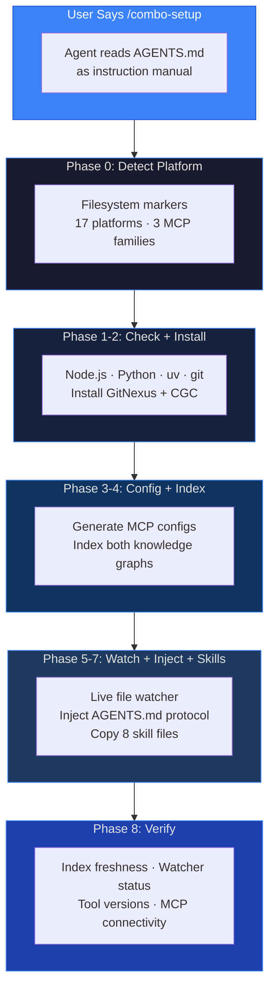

# Code Intelligence Bootstrap Kit

[](LICENSE)
[](https://python.org)
[](#multi-platform-support)


> **One sentence, give your AI coding agent superpowers.** Drop this kit into any project, say `/combo-setup`, and your agent self-provisions GitNexus + CodeGraphContext — dual knowledge graphs for impact analysis, concept search, dead code detection, safe rename, execution tracing, and visual graphs.

## Why This Exists

AI agents grep blindly through files. This kit gives them a dual knowledge graph so they stop grepping and start querying. Before every edit: impact analysis shows the blast radius. Before every commit: change detection maps diffs to affected symbols. After setup, the agent enforces impact-analysis-before-edit discipline forever — it's injected as behavioral rules in AGENTS.md.


## Architecture



| Tool | Best For | MCP Tools |
|------|----------|:---------:|
| **GitNexus** | Impact analysis, safe rename, execution flows, semantic search, change detection | 7 |
| **CodeGraphContext** | Code search, dead code detection, class hierarchy, import analysis, visual graph, Cypher | 21 |


## Quick Start

**You never run a command yourself.** Open this project in your AI coding tool and ask:

> **`/combo-setup`** or **"Set up code intelligence"**

The agent detects your platform, checks your environment, installs tools, generates MCP configs, indexes your codebase, and writes permanent behavioral rules.

### GitHub Template

1. Click **"Use this template"** → **"Create a new repository"**
2. Open in your AI coding tool
3. Say: `/combo-setup`

### Manual Clone

```bash
git clone https://github.com/Im-Busy/gitnexus-cgc-combo.git
cd gitnexus-cgc-combo
rm -rf .git && git init && git add -A && git commit -m "Initial: Code Intelligence Bootstrap Kit"
```

Open in your AI coding tool and say `/combo-setup`.

## What Gets Provisioned

| Layer | What | How |
|-------|------|-----|
| **GitNexus** | Impact analysis, safe rename, execution flows, change detection, semantic search | `npx gitnexus@latest` |
| **CGC** | Code search, dead code, class hierarchy, imports, complexity, visual graph | `uv pip install codegraphcontext` |
| **MCP Configs** | Both tools registered in correct format for your platform | Auto-generated, merged (never overwrites) |
| **Agent Protocol** | Always/Never rules injected into AGENTS.md | Idempotent markers |
| **Skills** | 8 operational skills | Copied to platform skill directory |
| **File Watcher** | CGC live watcher auto-updates graph on changes | systemd / launchd / PowerShell |

## After Setup — Agent Behavior Changes Forever

| When | What Happens |
|------|-------------|
| **Before editing any function** | Runs `impact()` — blast radius + risk level |
| **Before committing** | Runs `detect_changes()` — diff mapped to affected symbols |
| **Exploring unfamiliar code** | Uses concept search instead of grep |
| **Renaming a symbol** | Graph-assisted rename via call graph |
| **Tracing bugs** | Execution flow step-by-step tracing |

## Multi-Platform Support

Auto-detects and generates correct MCP config for **17 platforms**: Kilo · Claude Code · Codex · Cursor · Cline · Roo Code · Continue.dev · OpenCode · GitHub Copilot (VS Code + CLI) · Windsurf · Augment Code · FactoryAI · Gemini CLI · Hermes · Kiro · Mastra Code · Pi Agent

## Slash Commands

| Command | Purpose |
|---------|---------|
| `/combo-setup` | Full provisioning: detect → check → install → config → index → AGENTS.md injection → verify |
| `/combo-diagnose` | Health check: index freshness, watcher status, MCP connectivity, tool versions |
| `/combo-uninstall` | Remove everything: MCP entries, AGENTS.md sections, skill files, indexes, stop watcher |

## License

MIT
